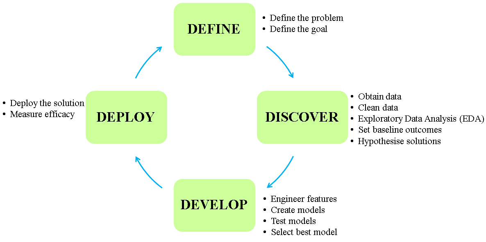

# E-shop Recommender Engine

# Solution strategy framework for the data science problem

# 1- Define the problem and goal
## The problem
An e-shop wants to increase their revenue by suggesting items similar to the items customers have put in their basket, while they are shopping online.

## The goal
The e-shop needs a recommender engine to suggest to the customers, the items that are similar to the items they already have put in their baskets. In this way, the chances of selecting and purchasing new items by the customers from the online platform of the e-shop, and hence the revenue of the e-shop will increase.

# 2- Discover the data
## Step 2.1: Loading the data
The provided data are the purchase history of multitude of customers from the e-shop during 2 weeks.

## Step 2.2: Examining and high level overviewieng the data
CELL 5
