# E-shop Recommender Engine

# Solution strategy framework for the data science problem

# 1- Define the problem and goal
## The problem
An e-shop wants to increase their revenue by suggesting items similar to the items customers have put in their basket, while they are shopping online.

## The goal
The e-shop needs a recommender engine to suggest to the customers, the items that are similar to the items they already have put in their baskets. In this way, the chances of selecting and purchasing new items by the customers from the online platform of the e-shop, and hence the revenue of the e-shop will increase.

# 2- Discover the data
## Step 2.1: Loading the data
The provided data are the purchase history of multitude of customers from the e-shop during 2 weeks.

## Step 2.2: Examining and high level overviewieng the data
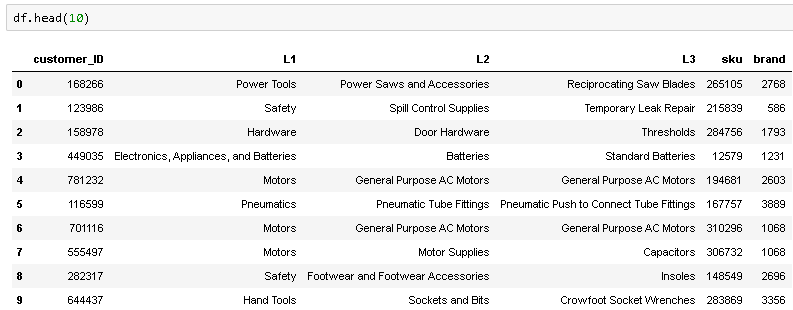

The dataframe has 6 columns as follows:
* **customer_ID:** Every customer, has a unique ID, however, might have bought more than one item from the e-shop. Hence, there are repetitions in the customer_ID column.
* **L1:** Level 1 Product hierarchy (most broad)
* **L2:** Level 2 Product hierarchy
* **L3:** Level 3 Product hierarchy (most granular)
* **sku:** Product ID (encoded)
* **brand:** Product brand (encoded)

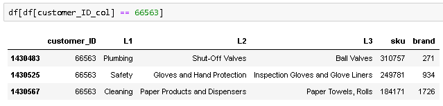

Examining a sample customer shows that they have bought 3 items from the e-shop. Hence, the elements in the customer_ID column are not all unique numbers.

## Step 2.3: Inspect more detail of the dataset (i.e. length, columns and data types)

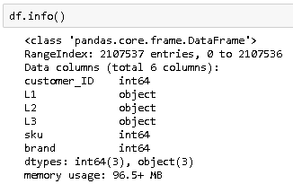

* The dataframe has 2,107,537 entries.
* All the columns are categorical.
* Object columns:
    * L1
    * L2
    * L3
* Numerical columns:
    * customer_ID
    * sku
    * brand

## Step 2.4: Checking for duplicates and NaN values

There are duplicates in the dataframe, since some of the customers have bought the same item several times. Hence, this is fine and is not an issue to take care of.

The dataframe has no NaN values, and hence it is a nice and clean dataframe.

In case of presence of any NaN values, this needed to be investigated further. It should be decided how to handle them, whether  they should be dropped or be replaced based on the similar items.

## Step 2.5: Creating the test and training dataframes
### Step 2.5.1: Extraction of the elements of the test set from the dataframe
This is performed based on the available dataframe. The test dataframe includes:
* 2 samples of customers that have bought 1 item, 
* 2 samples of customers that have bought 2 items, 
* 2 samples of customers that have bought 3 items.

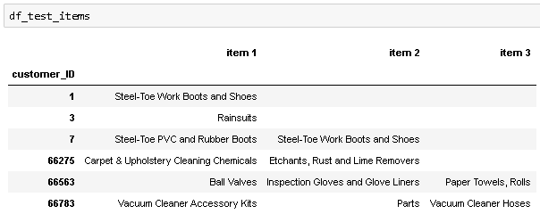

The items listed for every customer_ID in the df_test_items are taken from the most granular level, i.e. L3, of the df_test. For example, the customer_ID 66783 has purchased 3 items as follows:
* Vacuum Cleaner Accessory Kits
* Parts
* Vacuum Cleaner Hoses

The target of the recommender engine is to suggest other items to each of these customers that are very similar to the items they already have put in their baskets.

### Step 2.5.2: Creating the training dataframe by first dropping small orders

The training set has 248,099 entries out of 2,107,537 entries of the main dataframe, from the customers that have bought at least 20 items.

### Step 2.5.3: Concatinating the training set and the test set

### Step 2.5.4: One hot encoding the column 'L3', the most granular column

The above two steps are performed so that the items in the test dataframe also appear and be encoded in the list of items. In other words, the engine needs to have seen them before it is asked to suggest similar items to these items in the test dataframe. The engine is not trained considering these items, however, it needs to consider these items in its list of all the items.

### Step 2.5.5: Dropping the unwanted columns
The columns below are dropped:
* L1
* L2
* L3
* sku
* brand

### Step 2.5.6: Extracting the training set and test set from the concatinated and processed dataframe

### Step 2.5.7: Consolidating the training set and test set

### Step 2.5.8: Overviewing the training set and test set
A high level overview of the training set and test set is performed to ensure correct and perfect dataframes are produced to be fed to the recommender engine (training set) and evaluate the performance of it (test set).

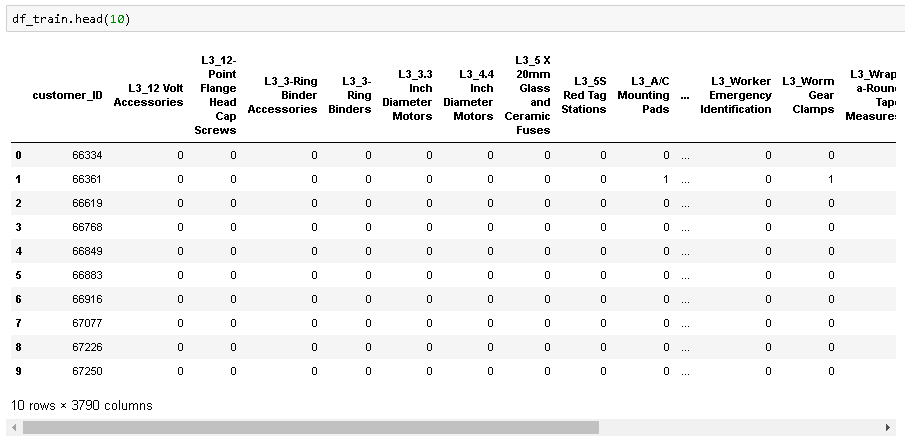

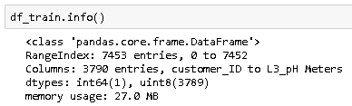

The training set consists of 7,453 unique customers that have purchased at least min_order_size_train (20 in this case) items.

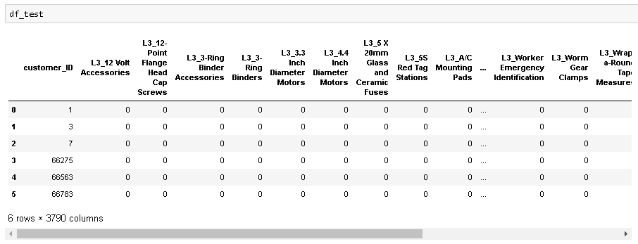

The test set consists of 6 unique customers selected from multitude of customers that have bought less than max_order_size_test (3 in this case) items.

Both training set and test set are nice and clean and can be used to develop the recommender engine and evaluate its performance.

## Step 2.6: Prepare a list of all the items 
This is a list of all the items purchased by the customers that are present in both the training set and test set.

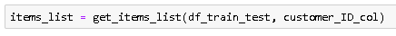

# 3- Develop the recommender engine

The developed recommender engine calculates the similarity based on the **'Jaccard similarity'**, which is illustrated as below:

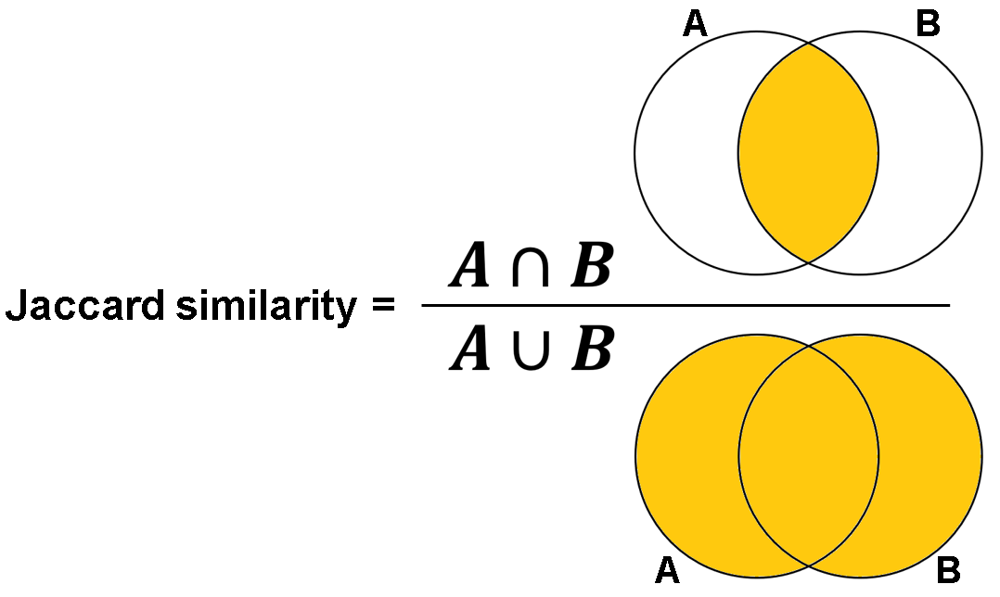

In the above definition:
* A: represents the customers that have purchased item A.
* B: represents the customers that have purchased item B.
* Intersection of A and B: the customers that have purchased both items A and item B.
* Union of A and B: All the customers that have purchased either item A or item B.

Jaccard similarity is defined as the division of the intersecction of items A and B by the union of items A and B. It does not consider how many of an item X is purchased by a customer. Also, it is the best algorithm that can be used for this type of problem, since either an item has been purchased or not. Additionally, it is the best choice of algorithm since this problem does not deal with scoring the items by the customers.

As an example: 
Item A has been purchased by customers: {'Mark', 'Kat', 'Jon'}, and item B has been purchased by customers {'Kat', 'Sam'}. Hence, both items A and B have been purchased only by 'Kat', meaning intersection of items A and B has just 1 member. Items A and B have been purchased by 'Mark', 'Kat', 'Jon', and 'Sam', meaning the union of items A and B has 4 members. Therefore, the Jaccard similarity of item A to item B is 1 / 4 = 0.25 . 

Hence, it can be concluded that:
* Jaccard similarity of item A to item B is equal to Jaccard similarity of item B to item A.
* Jaccard similarity of item A to item A is equal to 1.

### Creating the Jaccard similarity matrix
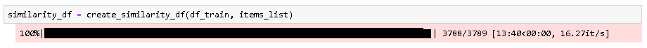

Once a set of new customers, in this case the test set, is fed to the engine, it:
* calculates the similarity of their orders with the available items based on the Jaccard similarity matrix.
* ranks the items based on the calculated similarities.
* suggests the top items similar to the items in the customers' baskets.

This has been illustrated in the next section using the test dataset.

# 4- Deploy the the recommender engine

## Step 4.1: Creaitng the list of customers
This list is created using the test dataset prepared in Section 2 (Discover the data).

## Step 4.2: Scoring the baskets of the customers

## Step 4.3: Generating the top recommendations for the customers

## Step 4.4: Creating the final 'result' dataframe

## Step 4.5: Evaluating the performance of the recommender engine 

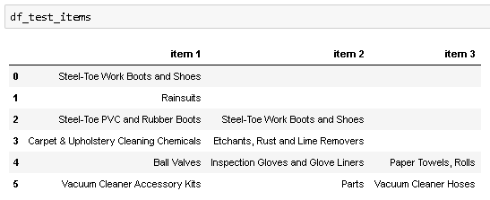

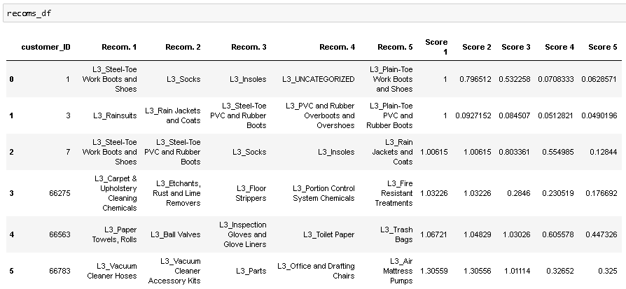

A few of the recommendations to the customers, developed by the engine (reported by 'item name, similarity'), are evaluated:
* The recommendations to the customer with the index 0, who has bought 'Steel-Toe Work Boots and Shoes' are: 'Socks, 0.79', 'Insoles, 0.53', and 'Plain-Toe Work Boots and Shoes, 0.06'. All the recommended items have high chances to be needed by the customer even though the similarity of the last item is less than 0.1.
* The recommendations to the customer with the index 2, who has bought 'Steel-Toe PVC and Rubber Boots' and 'Steel-Toe Work Boots and Shoes' are: 'Socks, 0.80, 'Insoles, 0.55', and 'Rain Jackets and Coats, 0.12', which are all very similar to the items bought by the customer and the customer might need and take them as well.
* The recommendations to the customer with the index 4, who has bought 'Ball Valves', 'Inspection Gloves and Glove Liners' and 'Paper Towels, Rolls' are: 'Toilet Paper, 0.60' and 'Trash Bags, 0.44', which might be needed for cleaning as the customer is taking the former items for cleaning and might need the latter ones.

Based on the evaluation of recommendations generated by the engine, it can be seen the engine has correctly identified the items similar to the items purchased by the customers. Hence, it is a powerful tool that can be deployed further to some improvements below, to help increase the revenue of the e-shop.

### Writing the recommendations in a csv file

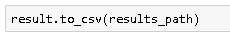

## Improvements to the recommender engine
* The devloped engine recommends exactly the same items that are already in the customer's basket. This can be frustrating and confusing for the customer. In the later versions, this needs to be dealt with and these items should be filtered out.
* Currently, the recommender engine does not consider the brand of items. Some people will purchase items from a brand just because they prefer that brand, even though they might not even need the item at the time of purchase. This important feature can be considered to further improve the performance of the developed engine and increase the revenue of the e-shop.
* The Level 1 (Product hierarchy - most broad) and Level 2 (Product hierarchy) have not been considered in the model. Considering these levels of hierarchy in the recommender engine will further improve the performance of it.
